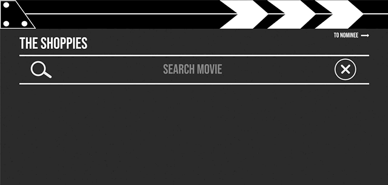
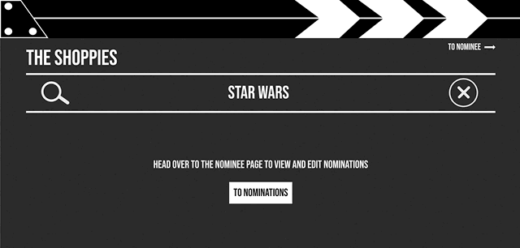

# The Shoppies Award

\*\*It's Live! View it [here!](https://theshoppiesawards.netlify.app/)

## Description

Shopify has branched out into movie award shows (imaginary, not real) and wants to build an app to help manage their movie nominations for the upcoming Shoppies. This application can search OMDB for movies, and allow users to save their top 5 favourite films they feel should be up for nomination.

## Table of Contents

- [Technologies](#technologies)
- [Installation](#install)
- [Features](#features)
- [Future Features](#futurePlans)
- [Struggles](#str)

## <a name="technologies"></a>Technologies

- [React](https://reactjs.org/docs/getting-started.html)
- [styled-components](https://styled-components.com/)
- [React Router](https://reactrouter.com/)
- [React-Spring](https://www.react-spring.io/)
- [Netlify](https://www.netlify.com/) for deployment

## <a name="install"></a>Installation

Clone the-shoppies repository

```
$ git clone https://github.com/JinaZhu/the-shoppies.git
```

Install dependencies

```
npm install
```

Run the app

```
npm run start
```

## <a name="features"></a>Features

- Search OMDB api for movies
- View movie details
- Add or remove movies from nomination list
- Nominated movies are saved in local storage
- View nominations that's powered by React-Spring with swiping effect
  - Swipe left to view next nomination
  - Swipe right to delete nomination

 

## <a name="futurePlans"></a>Future Features

- Create shareable link that enable user to send to friends and allow friends to vote to determine the winner
- Instead of allowing only 5 nominations, create categories that allows 5 nominations per category

## <a name="struggles"></a>Struggles

Creating the poster stack for the nominee route was the first time I've built something complex using React-Spring. I admired the swiping stack on the React-Spring sample page and wanted to challenge myself to take apart the [code sandbox](https://codesandbox.io/s/cards-fduch) and get it to work the way I wanted it to. There were many parts that I didn't fully understand what it does but console logging, playing around, and seeing what appeared helps me understand it enough to embed the delete function inside the stack function that I took from the code sandbox.

Test it out! [HERE!](https://theshoppiesawards.netlify.app/)
